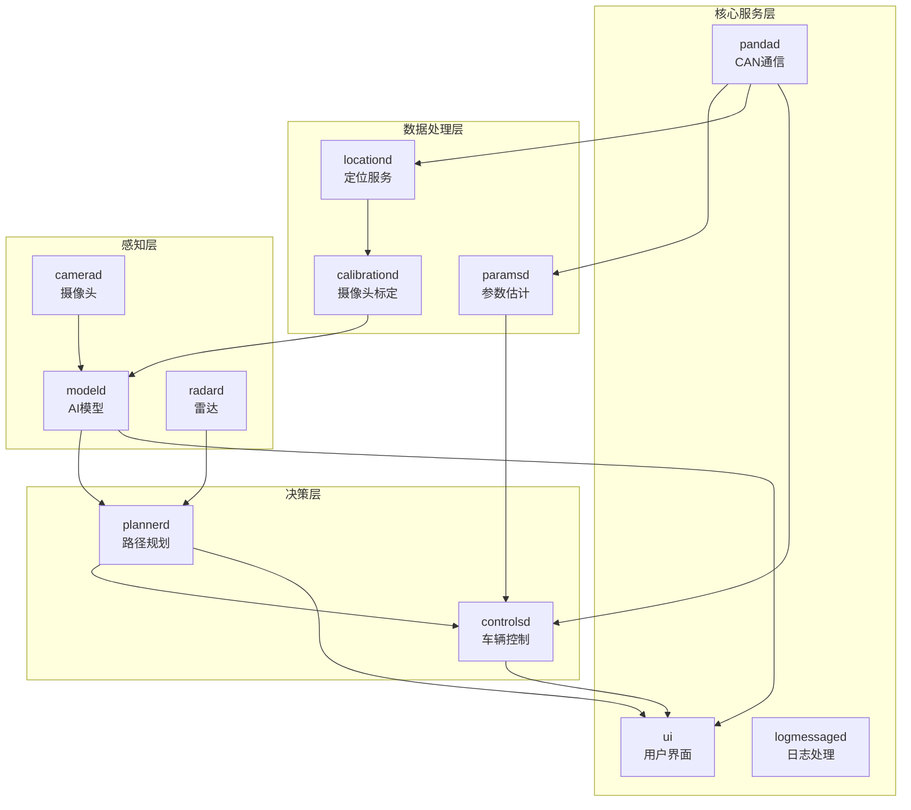

# openpilot 进程启动指南

## 概述

openpilot 使用进程管理器来协调所有进程的启动和运行，**不能直接启动单个进程**（如 `selfdrive/ui/ui.py`），必须通过启动脚本来正确初始化整个系统。

## 正确的启动方式

### 1. 标准启动（推荐）
```bash
# 在 openpilot 根目录下
./launch_openpilot.sh
```

### 2. PC 开发模式启动
```bash
export NOBOARD=1        # 无硬件板卡模式
export SIMULATION=1     # 仿真模式
export SKIP_FW_QUERY=1  # 跳过固件查询
./launch_openpilot.sh
```

### 3. 仿真模式启动
```bash
# 使用专门的仿真启动脚本
./tools/sim/launch_openpilot.sh
```

## 启动脚本详细流程分析

### 脚本调用链
```
launch_openpilot.sh → launch_chffrplus.sh → manager.py → 各子进程
```

### 1. launch_openpilot.sh
```bash
#!/usr/bin/env bash
exec ./launch_chffrplus.sh
```
**作用**: 简单的入口脚本，直接调用 launch_chffrplus.sh

### 2. launch_chffrplus.sh 详细流程

#### 2.1 环境初始化
```bash
# 加载环境变量
source "$DIR/launch_env.sh"
```

#### 2.2 launch_env.sh 设置的关键环境变量
```bash
export OMP_NUM_THREADS=1      # OpenMP 线程数限制
export MKL_NUM_THREADS=1      # Intel MKL 线程数限制
export PASSIVE=1              # 被动模式（不控制车辆）
export PC=1                   # PC 模式标识
export OPENPILOT_DATA=/tmp/data  # 数据存储路径
export QCOM_PRIORITY=12       # 高通芯片优先级
```

#### 2.3 系统检查和更新
```bash
# 移除可能的 Git 锁文件
[ -f "$DIR/.git/index.lock" ] && rm -f $DIR/.git/index.lock

# 检查 overlay 更新
if [ -f "${DIR}/.overlay_init" ]; then
    # 检查是否有更新需要安装
    # 如果有，会重启到新版本
fi
```

#### 2.4 Python 路径设置
```bash
# 设置 Python 路径
ln -sfn $(pwd) /data/pythonpath
export PYTHONPATH="$PWD"
```

#### 2.5 硬件特定初始化
```bash
# AGNOS 系统初始化（如果在 AGNOS 上运行）
if [ -f /AGNOS ]; then
    agnos_init  # 设置 GPU 权限、检查更新等
fi
```

#### 2.6 启动管理器
```bash
# 切换到 manager 目录
cd system/manager

# 如果需要，编译 manager
if [ ! -f $DIR/prebuilt ]; then
    ./build.py
fi

# 启动进程管理器
./manager.py
```

### 3. manager.py 启动流程

#### 3.1 初始化阶段 (manager_init)
```python
# 清理启动参数
params.clear_all(ParamKeyFlag.CLEAR_ON_MANAGER_START)

# 设置版本信息
params.put("Version", build_metadata.openpilot.version)
params.put("GitCommit", build_metadata.openpilot.git_commit)

# 设备注册
dongle_id = register(show_spinner=True)

# 初始化日志系统
sentry.init(sentry.SentryProject.SELFDRIVE)
cloudlog.bind_global(dongle_id=dongle_id, ...)

# 预导入所有进程模块
for p in managed_processes.values():
    p.prepare()
```

#### 3.2 主循环 (manager_thread)
```python
# 设置忽略的进程
ignore = []
if params.get("DongleId") in (None, UNREGISTERED_DONGLE_ID):
    ignore += ["manage_athenad", "uploader"]
if os.getenv("NOBOARD") is not None:
    ignore.append("pandad")
ignore += [x for x in os.getenv("BLOCK", "").split(",") if len(x) > 0]

# 消息订阅
sm = messaging.SubMaster(['deviceState', 'carParams', 'pandaStates'])
pm = messaging.PubMaster(['managerState'])

# 主循环
while True:
    sm.update(1000)
    started = sm['deviceState'].started
    
    # 根据状态启动/停止进程
    ensure_running(managed_processes.values(), started, 
                   params=params, CP=sm['carParams'], not_run=ignore)
    
    # 发布管理器状态
    msg = messaging.new_message('managerState', valid=True)
    msg.managerState.processes = [p.get_process_state_msg() 
                                  for p in managed_processes.values()]
    pm.send('managerState', msg)
```

## 启动脚本执行的关键操作

### launch_chffrplus.sh 执行的操作

1. **环境变量加载**
   ```bash
   source "$DIR/launch_env.sh"  # 加载核心环境变量
   ```

2. **Git 状态检查**
   ```bash
   # 移除可能的 Git 锁文件
   [ -f "$DIR/.git/index.lock" ] && rm -f $DIR/.git/index.lock
   ```

3. **系统更新检查**
   ```bash
   # 检查是否有 overlay 更新需要安装
   if [ -f "${DIR}/.overlay_init" ]; then
       # 比较文件修改时间，决定是否更新
       find ${DIR}/.git -newer ${DIR}/.overlay_init
   fi
   ```

4. **Python 环境设置**
   ```bash
   # 创建符号链接，设置 Python 路径
   ln -sfn $(pwd) /data/pythonpath
   export PYTHONPATH="$PWD"
   ```

5. **硬件初始化** (如果在 AGNOS 系统上)
   ```bash
   if [ -f /AGNOS ]; then
       agnos_init  # GPU 权限设置、启动标记等
   fi
   ```

6. **Tmux 日志记录**
   ```bash
   # 将 tmux 滚动缓冲区写入文件
   tmux capture-pane -pq -S-1000 > /tmp/launch_log
   ```

7. **Manager 编译和启动**
   ```bash
   cd system/manager
   if [ ! -f $DIR/prebuilt ]; then
       ./build.py  # 首次运行时编译
   fi
   ./manager.py  # 启动进程管理器
   ```

### manager.py 执行的关键操作

#### 初始化阶段操作
```python
def manager_init():
    # 1. 保存启动日志
    save_bootlog()
    
    # 2. 清理各种启动参数
    params.clear_all(ParamKeyFlag.CLEAR_ON_MANAGER_START)
    params.clear_all(ParamKeyFlag.CLEAR_ON_ONROAD_TRANSITION)
    
    # 3. 设置默认参数值
    for k in params.all_keys():
        default_value = params.get_default_value(k)
        if default_value is not None and params.get(k) is None:
            params.put(k, default_value)
    
    # 4. 创建消息队列目录
    os.mkdir(Paths.shm_path())
    
    # 5. 设置版本和设备信息
    params.put("Version", build_metadata.openpilot.version)
    params.put("GitCommit", build_metadata.openpilot.git_commit)
    params.put("HardwareSerial", HARDWARE.get_serial())
    
    # 6. 设备注册
    dongle_id = register(show_spinner=True)
    os.environ['DONGLE_ID'] = dongle_id
    
    # 7. 初始化错误报告和日志
    sentry.init(sentry.SentryProject.SELFDRIVE)
    cloudlog.bind_global(dongle_id=dongle_id, version=version, ...)
    
    # 8. 预导入所有进程模块
    for p in managed_processes.values():
        p.prepare()
```

#### 主循环操作
```python
def manager_thread():
    # 1. 设置忽略进程列表
    ignore = []
    if params.get("DongleId") in (None, UNREGISTERED_DONGLE_ID):
        ignore += ["manage_athenad", "uploader"]
    if os.getenv("NOBOARD") is not None:
        ignore.append("pandad")
    ignore += os.getenv("BLOCK", "").split(",")
    
    # 2. 设置消息订阅和发布
    sm = messaging.SubMaster(['deviceState', 'carParams', 'pandaStates'])
    pm = messaging.PubMaster(['managerState'])
    
    # 3. 初始启动所有进程
    ensure_running(managed_processes.values(), False, 
                   params=params, not_run=ignore)
    
    # 4. 主监控循环
    while True:
        sm.update(1000)  # 1秒更新间隔
        started = sm['deviceState'].started
        
        # 根据车辆状态启动/停止进程
        ensure_running(managed_processes.values(), started,
                       params=params, CP=sm['carParams'], not_run=ignore)
        
        # 显示进程状态
        running = ' '.join(f"{'🟢' if p.proc.is_alive() else '🔴'}{p.name}"
                          for p in managed_processes.values() if p.proc)
        print(running)
        
        # 发布管理器状态
        msg = messaging.new_message('managerState', valid=True)
        msg.managerState.processes = [p.get_process_state_msg() 
                                      for p in managed_processes.values()]
        pm.send('managerState', msg)
        
        # 检查退出条件
        if params.get_bool("DoUninstall") or \
           params.get_bool("DoShutdown") or \
           params.get_bool("DoReboot"):
            break
```

## 进程管理架构

### 核心组件

1. **manager.py** - 进程管理器
   - 启动和监控所有子进程
   - 处理进程崩溃和重启
   - 管理进程间依赖关系

2. **process_config.py** - 进程配置
   - 定义所有进程的启动条件
   - 配置进程类型和参数

### 主要进程类型

| 进程名 | 类型 | 启动条件 | 功能 |
|--------|------|----------|------|
| ui | PythonProcess | always_run | 用户界面 |
| modeld | PythonProcess | only_onroad | AI 驾驶模型 |
| controlsd | PythonProcess | iscar | 车辆控制 |
| camerad | NativeProcess | driverview | 摄像头数据 |
| pandad | PythonProcess | always_run | CAN 通信 |

### 启动条件说明

- `always_run`: 始终运行
- `only_onroad`: 仅在行驶时运行
- `only_offroad`: 仅在停车时运行
- `driverview`: 驾驶员监控模式
- `iscar`: 真实车辆模式
- `notcar`: 非车辆模式（仿真）

## 环境变量配置

### 常用环境变量

```bash
# 硬件相关
export NOBOARD=1           # 禁用硬件板卡
export SIMULATION=1        # 启用仿真模式
export USE_WEBCAM=1        # 使用网络摄像头

# 调试相关
export SKIP_FW_QUERY=1     # 跳过固件查询
export FINGERPRINT="MOCK"  # 强制指定车型
export BLOCK="camerad,loggerd"  # 阻止特定进程启动

# 功能开关
export PASSIVE=0           # 非被动模式，允许控制
export DISABLE_LOGGING=1   # 禁用日志记录
```

## 为什么不能直接启动单个进程

### 1. 依赖关系
- UI 需要 modeld 提供 AI 预测数据
- controlsd 需要 car 进程提供车辆状态
- 所有进程都依赖 pandad 进行 CAN 通信

### 2. 系统初始化
- 消息队列系统 (cereal) 需要初始化
- 参数管理系统 (Params) 需要设置
- 硬件抽象层需要配置

### 3. 进程间通信
```python
# 典型的消息流
pandad → car → controlsd → ui
       ↓
     modeld → plannerd → controlsd
```

## 调试单个进程

如果需要调试特定进程：

### 方法1: 使用 BLOCK 环境变量
```bash
# 阻止其他进程，只运行 UI
export BLOCK="modeld,controlsd,camerad"
./launch_openpilot.sh
```

### 方法2: 手动启动（不推荐）
```bash
# 先启动完整系统，然后重启特定进程
export PYTHONPATH=/home/wio/openpilot
cd /home/wio/openpilot
python3 selfdrive/ui/ui.py
```

## 常见问题

### Q: 启动后进程崩溃怎么办？
A: manager.py 会自动重启崩溃的进程，检查日志确定崩溃原因。

### Q: 如何查看进程状态？
A: manager.py 会在终端显示所有进程的运行状态（绿色=运行，红色=停止）。

### Q: PC 模式下需要哪些最小进程？
A: 至少需要：manager, ui, pandad, paramsd

## 启动流程瀑布图

```mermaid
gantt
    title openpilot 启动时序图
    dateFormat X
    axisFormat %s
    
    section 脚本启动
    launch_openpilot.sh    :0, 1
    launch_chffrplus.sh    :1, 3
    
    section 环境准备
    加载 launch_env.sh     :1, 2
    设置环境变量          :2, 3
    检查 Git 锁文件       :3, 4
    检查系统更新          :4, 6
    设置 Python 路径      :6, 7
    
    section Manager 初始化
    启动 manager.py       :7, 8
    清理启动参数          :8, 9
    设置版本信息          :9, 10
    设备注册              :10, 12
    初始化日志系统        :12, 13
    预导入进程模块        :13, 15
    
    section 进程启动阶段1 (always_run)
    pandad 启动           :15, 16
    ui 启动               :15, 16
    logmessaged 启动      :15, 16
    deleter 启动          :15, 16
    hardwared 启动        :15, 16
    statsd 启动           :15, 16
    uploader 启动         :15, 16
    
    section 进程启动阶段2 (条件启动)
    paramsd 启动          :16, 17
    locationd 启动        :17, 18
    calibrationd 启动     :18, 19
    torqued 启动          :19, 20
    
    section 进程启动阶段3 (onroad)
    modeld 启动           :20, 22
    plannerd 启动         :22, 23
    controlsd 启动        :23, 24
    radard 启动           :24, 25
    
    section 监控循环
    进程状态监控          :25, 30
    消息发布              :25, 30
    进程重启处理          :25, 30
```



## 详细启动时序说明

### 阶段1: 脚本启动 (0-7秒)
- **launch_openpilot.sh**: 入口脚本，立即调用下一级
- **launch_chffrplus.sh**: 主启动脚本，执行所有初始化工作
- **环境准备**: 加载环境变量、检查更新、设置路径

### 阶段2: Manager 初始化 (7-15秒)
- **系统初始化**: 清理参数、设置版本信息
- **设备注册**: 向 comma.ai 服务器注册设备
- **日志初始化**: 设置 Sentry 错误报告和云日志
- **模块预导入**: 提前导入所有进程模块以加快启动

### 阶段3: 进程分批启动 (15-25秒)

#### 第一批 - 核心服务 (always_run)
```python
# 这些进程无论什么状态都会启动
pandad      # CAN 通信守护进程
ui          # 用户界面
logmessaged # 日志消息处理
deleter     # 日志清理
hardwared   # 硬件抽象层
statsd      # 统计数据收集
uploader    # 数据上传
```

#### 第二批 - 定位服务 (条件启动)
```python
# 这些进程在特定条件下启动
paramsd     # 车辆参数估计
locationd   # GPS 定位
calibrationd # 摄像头标定
torqued     # 转向扭矩估计
```

#### 第三批 - 驾驶功能 (onroad)
```python
# 这些进程只在行驶时启动
modeld      # AI 驾驶模型
plannerd    # 路径规划
controlsd   # 车辆控制
radard      # 雷达处理
```

### 阶段4: 持续监控 (25秒后)
- **状态监控**: 每秒检查所有进程状态
- **自动重启**: 检测到进程崩溃时自动重启
- **消息发布**: 向其他进程广播管理器状态

## 进程依赖关系图



## 启动优化建议

### PC 开发模式优化
```bash
# 快速启动配置（跳过不必要的进程）
export NOBOARD=1
export SIMULATION=1
export SKIP_FW_QUERY=1
export BLOCK="loggerd,encoderd,micd,uploader,manage_athenad"
./launch_openpilot.sh
```

### 调试模式配置
```bash
# 只启动 UI 和基础服务
export BLOCK="modeld,controlsd,plannerd,radard,camerad"
./launch_openpilot.sh
```

### 性能监控
```bash
# 查看进程启动时间
time ./launch_openpilot.sh

# 监控进程状态
watch -n 1 'ps aux | grep -E "(modeld|controlsd|ui|pandad)"'
```

## 故障排除

### 常见启动问题
1. **进程启动失败**: 检查 `/tmp/data/logs/` 中的错误日志
2. **依赖缺失**: 确保所有 Python 依赖已安装
3. **权限问题**: 检查 `/tmp/data/` 目录权限
4. **端口冲突**: 确保 ZMQ 端口未被占用

### 启动时间优化
- **预编译**: 首次运行后会生成 `prebuilt` 标记文件
- **模块缓存**: Python 模块会被缓存以加快后续启动
- **并行启动**: manager 会并行启动独立的进程

## 总结

openpilot 的启动是一个精心设计的分阶段过程：
1. **脚本层**: 环境准备和路径设置
2. **管理层**: 系统初始化和设备注册  
3. **服务层**: 分批启动各功能进程
4. **监控层**: 持续监控和故障恢复

这种设计确保了系统的稳定性和可维护性，直接启动单个进程会破坏这种精心设计的依赖关系。